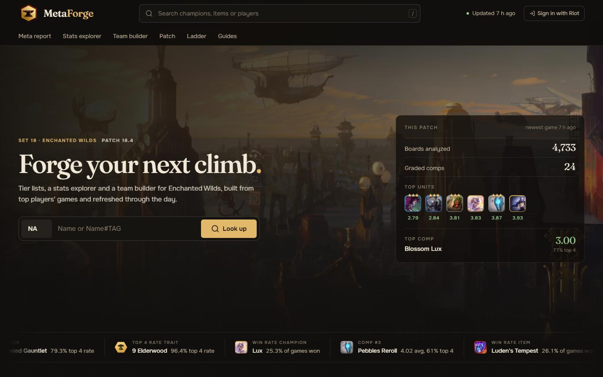
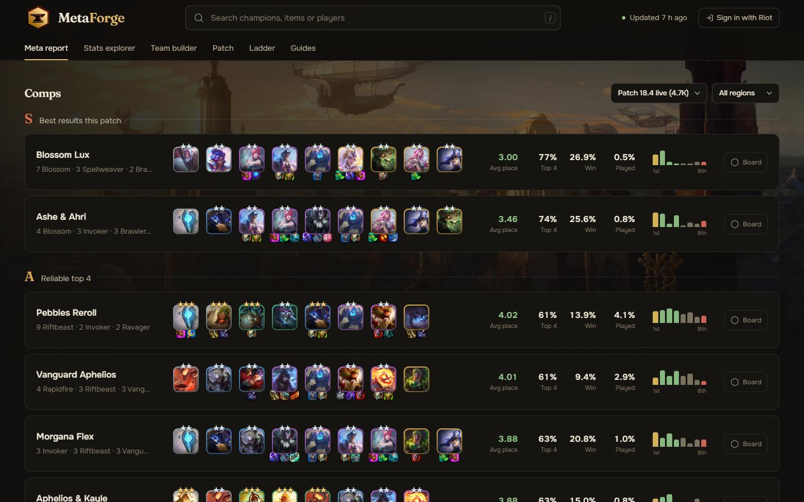
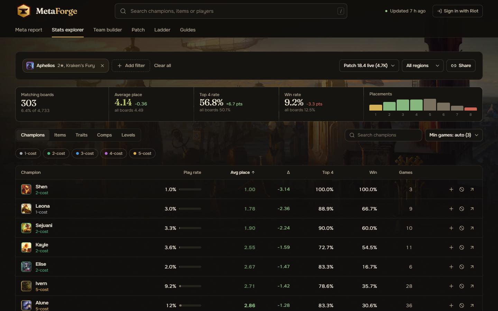
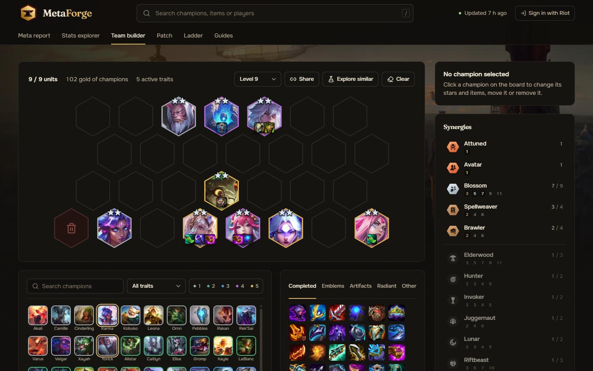

<div align="center">

<h1>MetaForge</h1>

<h3>Tier lists, stats and a team builder for Teamfight Tactics</h3>

[](https://nextjs.org)
[](https://typescriptlang.org)
[](https://tailwindcss.com)
[](https://postgresql.org)

<hr>

<h2>About</h2>

<p>MetaForge turns top players' Teamfight Tactics games into tier lists,<br>
a stats explorer and a team builder for the current set and patch.<br>
Matches are collected through the Riot Games API every hour,<br>
so the numbers keep moving through the day.</p>

<p>Look up any player by Name#TAG in 15 regions,<br>
or browse the ranked ladder.</p>

<hr>

<h2>Screenshots</h2>

<table align="center">
<tr>
<td align="center" width="50%">



<sub>Home</sub>

</td>
<td align="center" width="50%">



<sub>Meta report</sub>

</td>
</tr>
<tr>
<td align="center" width="50%">



<sub>Stats explorer</sub>

</td>
<td align="center" width="50%">



<sub>Team builder</sub>

</td>
</tr>
</table>

<hr>


<h2>Tools</h2>

<table align="center">
<tr>
<td align="center" width="33%">

<h3>Meta report</h3>

Comps grouped by carry<br>
Graded for the live patch<br>
Champion, item and trait<br>
tier lists

</td>
<td align="center" width="33%">

<h3>Stats explorer</h3>

Filter boards by<br>
champions, items,<br>
traits and level<br>
See how everything does<br>
on the boards that match

</td>
<td align="center" width="33%">

<h3>Team builder</h3>

Drag champions<br>
onto a board<br>
Add items and emblems<br>
See which traits are active<br>
Save boards, share links

</td>
</tr>
</table>

<hr>

<h2>Also on the site</h2>

<table align="center">
<tr>
<td align="center" width="33%">

<h3>Ladder</h3>

Standings for every region<br>
Match history per player

</td>
<td align="center" width="33%">

<h3>Guides</h3>

Fundamentals, item chart<br>
Emblem recipes<br>
How the set works

</td>
<td align="center" width="33%">

<h3>Patch notes</h3>

What changed in each patch

</td>
</tr>
</table>

<hr>

<h2>Stack</h2>

```javascript
const stack = {
  app: ["Next.js 16", "React 19", "TypeScript"],
  styling: ["Tailwind CSS 4", "Fraunces", "Onest"],
  data: ["Riot Games API", "PostgreSQL", "CommunityDragon"],
  jobs: ["Vercel Cron, hourly ingest"]
};
```

<hr>

<h2>Setup</h2>

<p>Needs Node.js 20.9 or newer.</p>

```bash
git clone https://github.com/gimzdev/metaforge.git
cd metaforge
npm install

cp .env.example .env.local
npm run dev
```

<p>Put a Riot API key in <code>.env.local</code>. Development keys expire every 24 hours.<br>
Without <code>DATABASE_URL</code> matches are stored in <code>./.data</code>, which is fine locally.<br>
Use a Postgres connection string for anything public.<br>
Every option is documented in <code>.env.example</code>.</p>

<hr>

<h2>Data collection</h2>

```bash
npm run db:init    # create the tables, safe to run again
npm run ingest     # run one collection pass
```

<p>On Vercel a cron job calls <code>/api/cron/ingest</code> every hour.<br>
Regions, players per run and how long matches are kept<br>
are set with the <code>INGEST_*</code> variables and <code>RETAIN_DAYS</code>.</p>

<hr>

[](https://metaforge.lol)

<p><sub>MetaForge is an independent project. It isn't endorsed by Riot Games,<br>
and Riot Games and all associated properties are trademarks of Riot Games, Inc.<br>
Game data by CommunityDragon.</sub></p>

</div>
